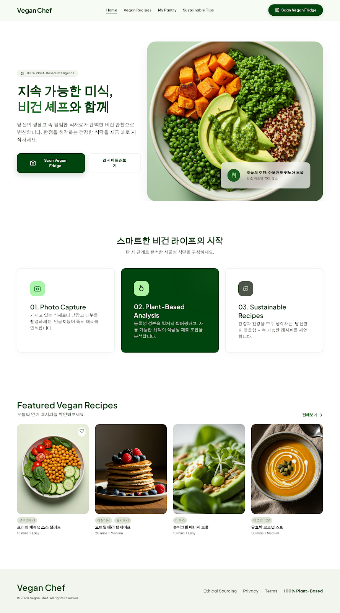
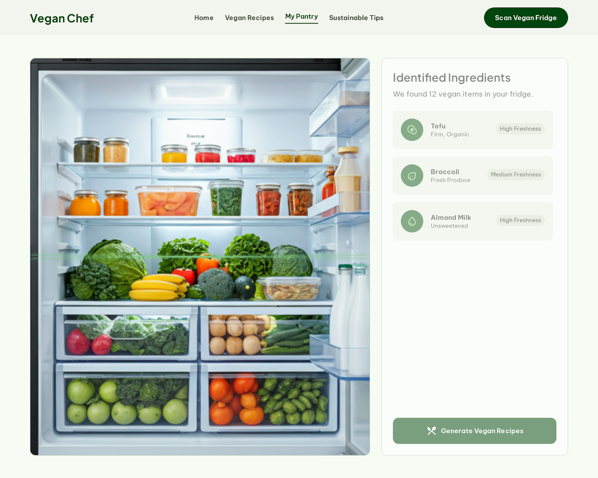
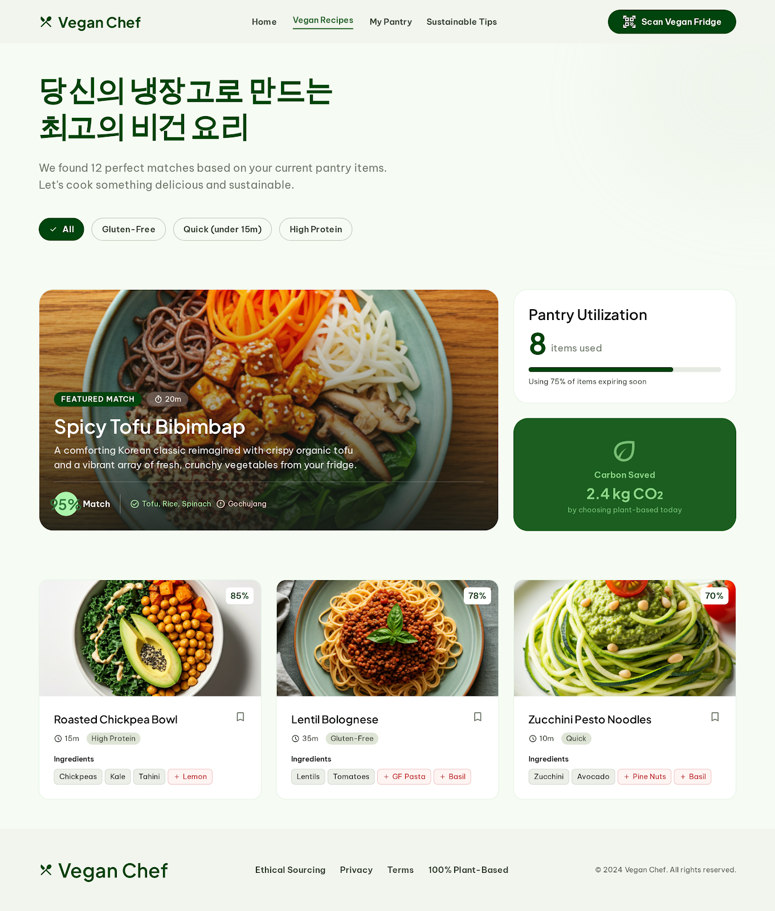
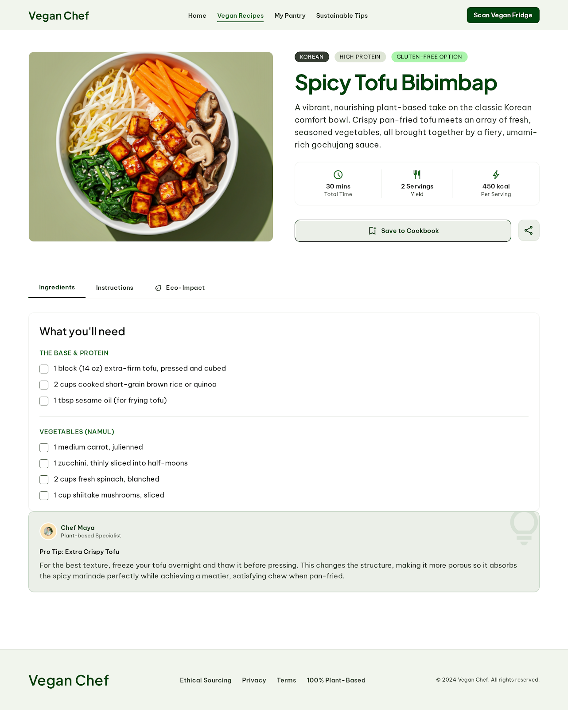

# 🌱 Vegan Chef

냉장고/식재료 **사진을 올리면** 비건 셰프 AI가 식물성 재료를 인식해, 동물성 재료 없이 **지금 만들 수 있는 비건 레시피**를 찾아주는 웹 앱입니다.

> **🔗 라이브 데모 — https://vegan-chef-225688553008.asia-northeast3.run.app**
> (Google Cloud Run · 서울 리전)

---

## ✨ 기능

- 📸 **냉장고 스캔** — 사진 업로드 → Claude Vision이 식물성 재료를 인식 (스캔 라인 + 바운딩 박스 연출)
- 🥗 **비건 레시피 매칭** — 보유 재료 충족도(매치율)순 정렬, `글루텐프리 / 퀵 / 고단백` 필터
- 📖 **레시피 상세** — 재료 체크리스트 · 단계별 조리법 · 에코 임팩트(절감 탄소·물) 탭
- 🌍 **지속 가능성** — 같은 요리를 육류로 만들 때 대비 절감되는 탄소·물을 표시
- 🛡 **비건 보장** — 육류·생선·달걀·유제품·꿀·젤라틴 등 동물성 재료를 100% 배제하고 식물성 대체재로 구성

## 🖥 화면

> 아래는 디자인 시안(Google Stitch). 실제 앱은 이 디자인을 React로 재현했습니다.

| 랜딩 | 팬트리 스캔 | 레시피 목록 | 레시피 상세 |
|---|---|---|---|
|  |  |  |  |

## 🧱 기술 스택

| 영역 | 사용 기술 |
|------|-----------|
| 프론트엔드 | React 18 · TypeScript · Vite · React Router · Tailwind CSS (Material 3 토큰) |
| 백엔드 | Express 5 (API 키를 서버에만 두는 프록시) |
| AI | Anthropic Claude — Vision 이미지 입력 + 구조화된 JSON 출력 |
| 배포 | Docker → Google Cloud Run |

폰트는 Plus Jakarta Sans(헤드라인) · Be Vietnam Pro(본문) · Material Symbols(아이콘).

## 🏗 구조

```
┌────────────┐  사진(base64)   ┌──────────────┐  이미지+스키마  ┌────────────┐
│ React SPA  │ ──────────────▶ │ Express 프록시 │ ─────────────▶ │ Claude     │
│ (Vite)     │ ◀────────────── │  (:3001)      │ ◀───────────── │ (Vision)   │
└────────────┘  레시피 JSON     └──────────────┘  구조화된 JSON  └────────────┘
```

- 개발: Vite(5173)가 `/api`를 Express(3001)로 프록시.
- 프로덕션: `NODE_ENV=production`이면 Express **하나**가 API + 빌드된 프론트(`dist`)를 함께 서빙하고, `/scan`·`/recipes/:id` 새로고침을 위한 **SPA 폴백**을 제공합니다.

## 🚀 로컬 실행

```bash
npm install
cp .env.example .env      # ANTHROPIC_API_KEY 입력 (https://console.anthropic.com)
npm run dev               # 프론트 5173 + 백엔드 3001 동시 실행
```

브라우저에서 http://localhost:5173 을 열고 냉장고 사진을 올려보세요.

## ⚙️ 환경 변수

| 변수 | 기본값 | 설명 |
|------|--------|------|
| `ANTHROPIC_API_KEY` | — | **(필수)** Anthropic API 키 |
| `ANTHROPIC_MODEL` | `claude-sonnet-4-6` | 사용 모델 (저렴: `claude-haiku-4-5`) |
| `PORT` | `3001` | 백엔드 포트 (Cloud Run은 자동 주입) |
| `MAX_OUTPUT_TOKENS` | `12000` | 요청당 출력 토큰 상한 (비용 상한선) |
| `RATE_LIMIT_HOURLY` | `5` | IP·시간당 분석 횟수 |
| `RATE_LIMIT_DAILY` | `20` | IP·하루 분석 횟수 |
| `GLOBAL_DAILY_CAP` | `200` | 전체·하루 분석 횟수 상한 |
| `NODE_ENV` | — | `production`이면 `dist` 정적 서빙 활성화 |

## 💸 비용 보호

AI 호출이 곧 비용이므로 다중 안전망을 둡니다.

- **앱 레벨** — IP별 시간/일 + 전체 일일 요청 상한 초과 시 `429`, 요청당 출력 토큰 상한.
- **계정 레벨** — Anthropic Console에서 선불 크레딧(자동충전 OFF) + 워크스페이스 spend limit 권장.

## ☁️ 배포

단일 서비스(API+프론트)로 Cloud Run에 배포합니다. 자세한 단계는 [DEPLOY.md](DEPLOY.md) 참고.

```bash
gcloud run deploy vegan-chef --source . \
  --region asia-northeast3 --allow-unauthenticated --max-instances 1 \
  --set-env-vars NODE_ENV=production,ANTHROPIC_API_KEY=...
```

`--max-instances 1`로 인메모리 요청 제한이 정확히 동작하도록 인스턴스를 1개로 고정합니다.

## 📝 참고

- 생성된 레시피 카드의 이미지는 브랜드 그린 **그라데이션 플레이스홀더**입니다. (모델은 텍스트 레시피를 생성하며, 그 요리의 실제 사진은 만들지 않습니다.) 랜딩/시안의 음식 사진은 디자인 자산입니다.
- 신선도·매치율·탄소/물 절감 수치는 모델의 추정값입니다.
- 스캔 화면의 바운딩 박스 위치는 연출용 프리셋입니다.
